#                                        **CI-MS3-Fruitbowl** - Code Institute Milestone Project 3, Data-centric Module

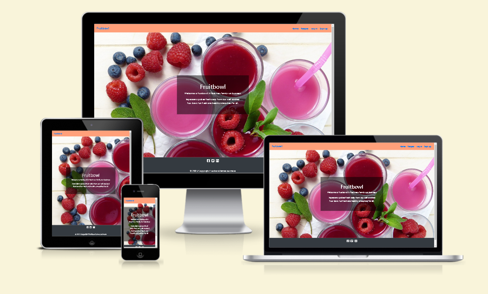
#                                      
A live website can be found [here](https://5000-jamesrcutmore-fruitbowl-z1qzsyiv3py.ws-eu98.gitpod.io)

## **Table of Contents**

 * [About](#about)
  * [User Experience](#User-experience)
  * [Project Goals](#project-goals)
  * [Target Audience](#target-audience)
  * [User Stories](#user-stories)
  * [Design](#design)
  * [Wireframe](#wireframe-views)
  * [Features](#features)
  * [Existing Features](#existing-features)
  * [Features Left to Implement](#features-left-to-implement)
  * [Technologies-Used](#technologies-used)
  * [Testing](#testing)
  * [Deployment](#deployment)
  * [Credits](#credits)
  * [Content](#content)
  * [Media](#media)
  * [Acknowledgements](#acknowledgements)

# **About** 
-  Fruitbowl is a place for smoothies recipes.

-  It is a platform for smoothies lovers to explore and share smoothies recipes with one another. 
-  The users also have the the  option of holding an account, there they can add, edit and delete the their own recipes.

- 

-  

# **User Experience**
As a general user:

- I want to be able to see recipes without having to register an account.

- I want to be able to search recipe with certain ingredients.

- I want to search by specific categories, ie. detox, kids friendly, weight loss etc.

- I want to be able to share my recipe with other people.

- I want to have an account so I can come back, add, edit or delete my recipe.

### **Project Goals**

- The project goal is to provide a platform for users who love smoothies to explore new recipes and also add more recipes to 
  share them with other users. As more and more users starting using the service, the website become a free resource.

### **Target Audience**

- The target audience are anyone who interested in healthy lifestyle and diet, who enjoys fruit and veg, or just simply 
  exploring new tastes and experiences.

# **User Stories**

 **General User Goals**
 - I want to be able to see recipes without having to register an account.

- I want to be able to search recipe with certain ingredients.

- I want to search by specific categories, ie. detox, kids friendly, weight loss etc.

- I want to be able to share my recipe with other people.

- I want to have an account so I can come back, add, edit or delete my recipe.

**_First Time User Goals_**

As a first time user:

- I want to know what the website is about.

- I want to explore around to get to know the place.

- I want to have a little taste about how the recipe looks like, is it something I am looking for.

- I want to know if there is an option to register and hold an account, so I can come back anytime and add recipe if I like.
- As a First Time Visitor, I want to know about the developer and their social media links.

**_Returning User Goals_**

As a returning user:

- I want to be able to log into my accout.

- I want to share my own recipe.

- I want to add recipe to pre-determined categories.

- I want to have access to the recipe I uploaded.

- I want to be able to edit or delete my own recipe anytime if I want to.

- I want to be able to log into my accout.

- I want to share my own recipe.

- I want to add recipe to pre-determined categories.

- I want to have access to the recipe I uploaded.

- I want to be able to edit or delete my own recipe anytime if I want to.

**_Site Owner/Admin Goals_**

As the site owner/admin:

- I want to be able to add new categories to the site.

- I want the new category to be added and displayed as a certain way to go with the flow of the entire site.

- I want to be able to edit the pre-existing categories.

- I want to be able to delete any categories.

 
# **Design**

+ **Colour Scheme** 

- I wanted to keep it colorful and fun!
  
- Bright  primary colours so to make it easy and fun to navigate.

  
+ **Typography**

  The main font throughout the quiz is Josefin Sans with a back up font of sans-serif.Here we used google fonts.
  [Google Fonts](https://fonts.google.com/)

+ **Imagery**
  The imagery for the quiz game is simple colouful and pleasing on the eye. The navigation buttons are bright primary colour's with 3D effect movement with the hover over.
- [Pixabay](https://pixabay.com/)

- [google images](https://www.google.com/imghp?hl=en/)

   ---
 # **Sitemap**

- The site is easy to navigate functional and responsive

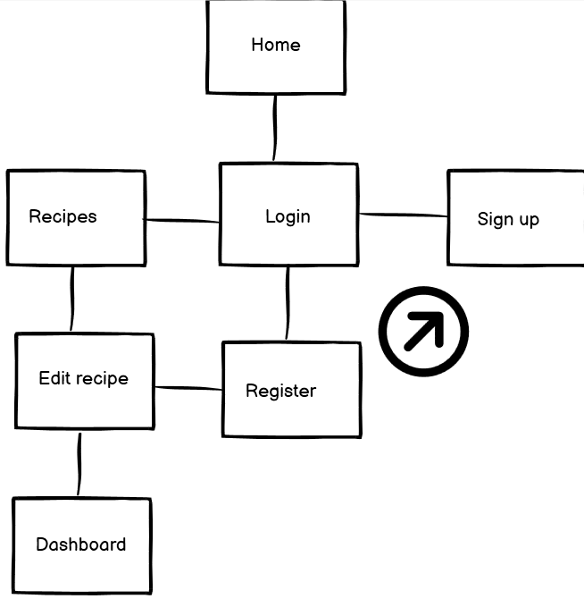
   
 # **Wireframe views**

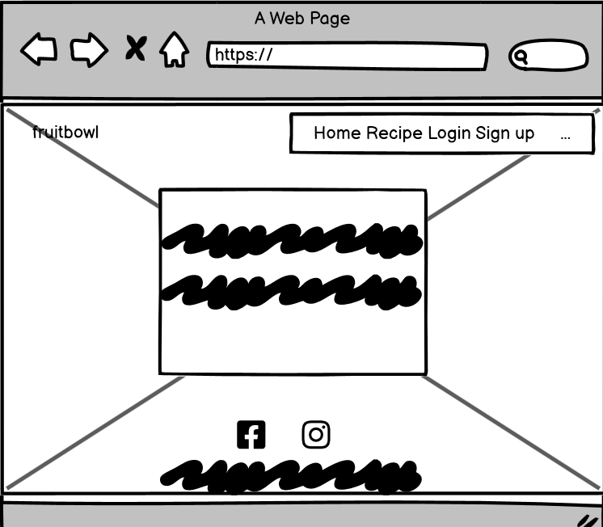
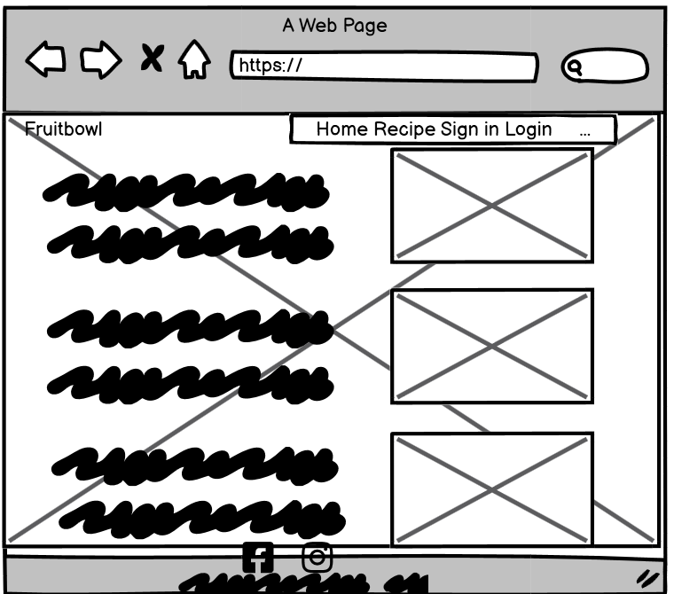
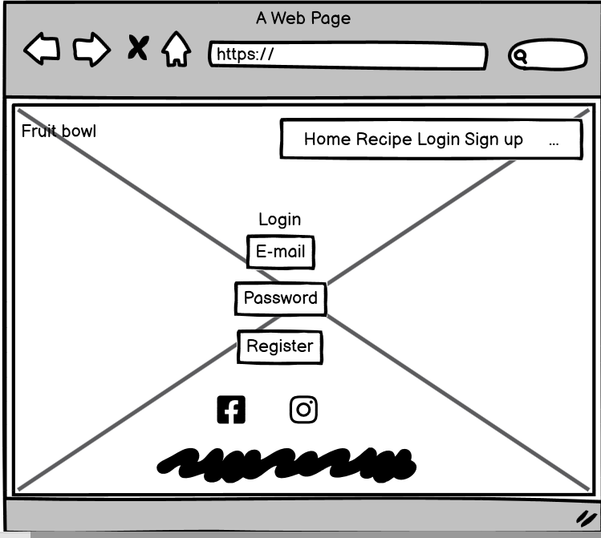

---

# **Wireframe Tablet view**

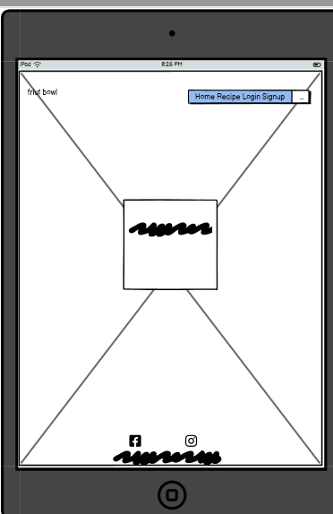
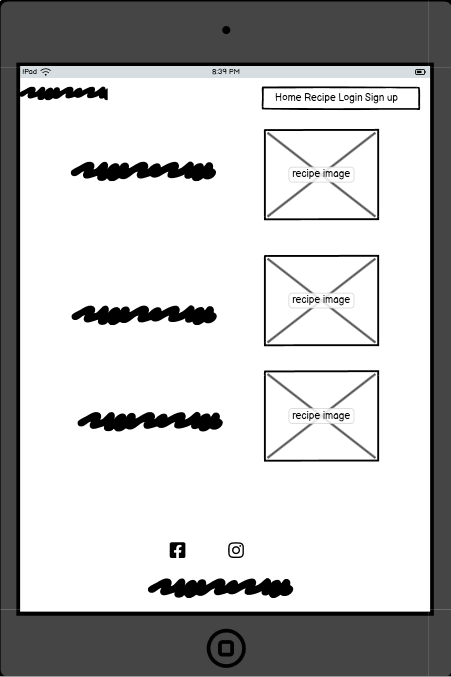
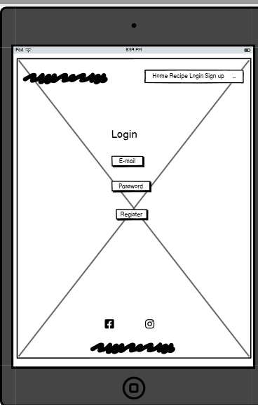
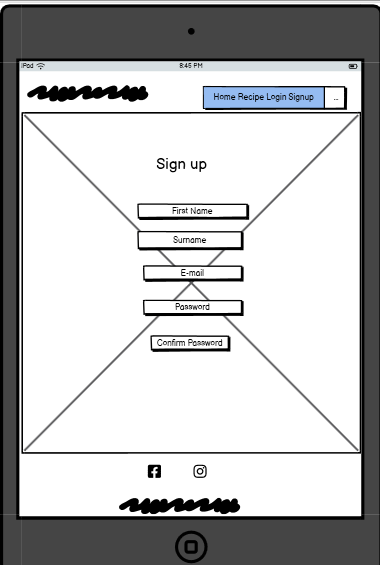

---

# **Wireframe Mobile view**

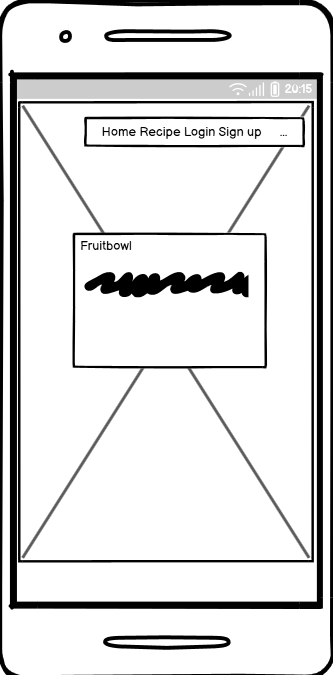
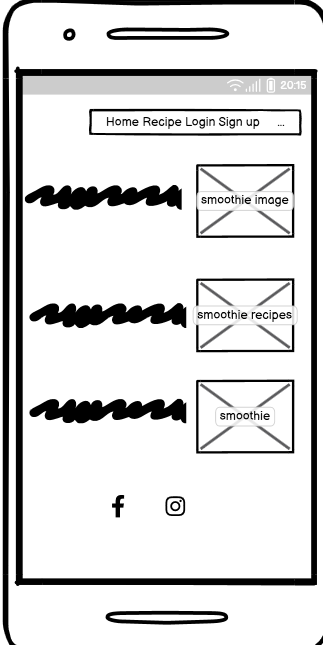
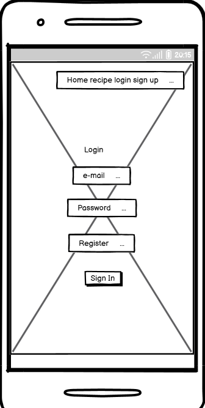
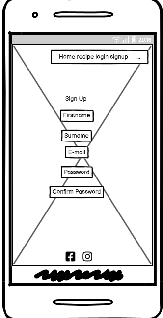
---
---

### **Features**

# **Existing Features**

- Homepage which entails navigation for game rule, mute button and leadrerboard. 

- You press play then the music starts which can be muted.

- you will have 60 seconds to answer all 20 questions.

- Multiple-choice section - gives the users four choices they can choose from.

- Once you've made all 20 choices a submit button should be pressed.

- You will be presented with a pop up message to indicate you have saved your score.

- once the game is finished it will shows the final score.

- You are then giving the oppertunity to save your score to the leaderboard.

- A play again button will then be presented.

# **Features Left to Implement**
+ A background image faded into background.
  More thoght into the colour scheme.
+ To have score's showing in decending order.
+ To have a sound effect added to radio button's when question is answered.
---

# **Languages Used**
- Javascript
- H.T.M.L
- C.S.S

# **Technologies Used**
[Local strorage](https://www.w3schools.com/jsref/prop_win_localstorage.asp)
 - Local storage was used to save score

[The Trivia API](https://the-trivia-api.com/)

- A trivia api was used to change question and keep the player interested.

 [HTML5](https://en.wikipedia.org/wiki/HTML#:~:text=The%20HyperText%20Markup%20Language%2C%20or,displayed%20in%20a%20web%20browser.)

- The language used to give the site its main structure and all necessary features.

[CSS3](https://en.wikipedia.org/wiki/CSS)

- The language used to give the application its visual effects including the font, color and layout etc.

 [Javascript](https://developer.mozilla.org/en-US/docs/Web/JavaScript)

- The language used to implement the site's interactive features, allow the users to be interactive and make actions 
  during their visit.

  ---
  ---

 # **Frameworks, Libraries & Programs Used**

[API's](https://the-trivia-api.com/)
The trivia API.com was used for randomized quiz questions

[VScode](https://code.visualstudio.com/)

Visual Studio Code has been used as a local code editor for write and manage all codes and files.

[Github](https://github.com/)

Github is used to create, store and maintain all codes in a repository.

Github is also used as the site hosting service for the final website to be published on.

[Git Version control](https://git-scm.com/)

 Git 2.31.1 for Mac is used for commit and push codes to Github.

[Google Fonts](https://fonts.google.com/)

The font used on this quiz were chosen from Google fonts.

[coolors](https://coolors.co/)

Insperation was gained from coolors pallete.

[Balsamiq](https://balsamiq.com/)

  The wireframes were created using Balsamiq.

 [Google DevTools](https://developer.chrome.com/docs/devtools/)

   Google DevTools was extensively used throughout the project for various styling, testing and debugging purposes.

 [Am I Responsive](http://ami.responsivedesign.is/)

   Am I responsive has been used to test the responsiveness of the site and also to create the mock-up image presented at the start of this document.

[W3C Markup Validation service](https://validator.w3.org/)

   W3C Markup Validation Service has been used to test the HTML codes.

 [W3C CSS Validation Service](https://jigsaw.w3.org/css-validator/)

   W3C CSS Validation Service has been used to test the CSS codes.

   ---
   

# **Testing**

## Manually Testing Functionality
### Navigation Buttons
+ Tested each page individually and clicked each button to make sure that they navigate to the correct place.
+ Tested each page individually on desktop and hovered over each button to make sure that Hover over is applied .
+ Tested each page individually on mobile and made sure hover over isn't applied.
### Home Button
+ Home buttton tested and working correctley.
### Play Again
+ Play again button tested and worked as expected. 
### Mute Button
+ Changed the mute button to on/off several times in one game to check for any issues, checking for both right and wrong answers. 
### Questions
+ Played several games to make sure that all questions were populating correctly. 
+ ### Quiz API
+ Started quiz several times to make sur api question where loading and functioning correctly.
### Answer Buttons
+ checked several games to make sure that all answers were populating correctly inside their buttons. 
+ Checked several games to make sure that all answers were populating for the correct question.
+ Made sure pop up appears if you do not select a question before you submit. 
 
### Main Game Display 
+ Made sure that if the answer is chosen, the score increments. 
+ Made sure that if the wrong answer is chosen, the score doesn't increment. 
+ Made sure that, regardless of right or wrong answer being chosen, the question number increments. 
### Submit Score
+ Added name to input field and submitted to check submit was working. 
### Saved Scores
+ Checked to make sure name and score were  saving in the local storage correctly.
+ Made sure that correct name and score were being added.   
+ Shut down device and restarted to make ensure that scores were being saved in local storage. 
### Timer
+ Timer works as exspected no issues.
+ Timer stops when Answers are answered before time is up.
+ Time's up message displayed when 60 seconds up.
### Questions Answered
+ You must answer a question before moving onto next.
+ Submit button will activate a message "Please answer Question".

| Feature | Expected Outcome | Testing Performed |  Actual Result | Outcome |
| --- | --- | --- | --- | --- |
| The Sites title | Link directs the user back to the home page | Clicked title |  page reloads | Pass |
| Game rules button | Displays the instructions on how to play the game | Clicked on button |  instructions on how to play opens | Pass |
|close button | Closes the message box | Clicked on close button | boxclosed | Pass |
|Radio  button | Answers a question | Clicked button | Question answers | Pass |
| Play Button | Takes you to play the game | Clicked on button | Game page opens to questions | Pass |
| Please Answer Question on submit if nothing answered message | Message pop's up | Message popped up when no questions answered  | Pass |
| Audio loop | When play button is clicked music loop will start | Clicked on button | Music plays | Pass |
| Timer  | When play button is clicked 60 seconds is displayed on timer | Clicked Play | Timer Starts | Pass |
| Save Scores input Button | Asks for you to save your score | Clicked on button | Name inputed | Pass |
| All buttons - hover effect | All buttons have hovered over with movement. | Hover over each button on the page |button movenment correctly performing  when hovered over | Pass |
|  Cursor pointer| cursor displayed when moved over buttons |  mouse  positionedover each button to check the cursor changed  | cursor changed when hoverd | Pass |
| Mute Button | Gives player the choice to have music or not | Clicked on button | muted impliment | Pass |
| unmute Button | Gives player the choice to have music unmuted | Clicked on button | unmuted impliment | Pass |
|Facebook social media link| Click link should take you directley to the site| Clicked link| straight to link as exspected | pass|
|Twitter social media link| Click link should take you directley to the site| Clicked link| straight to link as exspected | pass|
|Instagram social media link| Click link should take you directley to the site| Clicked link| straight to link as exspected | pass|
|Pintrest social media link| Click link should take you directley to the site| Clicked link| straight to link as exspected | pass|
---
# Automatic testing

### Validation
+ W3C Validation was used:
 - HTML
 - CSS
 - JS Hint was used to validate javascript.

 #  Links to above mentioned are in languages used.

# Known bugs

 

 + Game rules instruction's would initianly not implement, however after rectifying a class for an id in the code the   
   problem was solved.
---
+ Solved bug

# Lighthouse performance

+ ## Desktop Home screen
 
+ # Desktop Home screen score
 
+ # Desktop Game Rules
 
+ # Desktop Game  Rule score
 
+ # Desktop Leaderboard
 
+ # Desktop Leaderboard Score
 
+ # Desktop Question Page
 
+ # Desktop Qeustions page Score
 
+ ## Mobile view Home screen
 
 + # Mobile view Leaderboard Page
 
 + # Mobile view Questions page Score
 
 + # Mobile view Games Rules page
 

 ## Deployment & Local Development

### Deploying to Github Pages

* Choose the repository you want to deploy from the main overview.
* Go to settings by clicking on the icon on the menu.
* In the left navigation, select the "Pages" option.
* Under "Source", choose "Master" branch and click "Save".
* After it's done, you will see a message saying "Your site is ready to be published at (insert url here)".

### Local Development
#### How To Fork

Forking a repository is the process of creating a copy of the original repository. This enables you to make changes without affecting the main repository. 

To do so:-
* go to the GitHub repository you want to copy.
* select the 'Fork' button located in the top right corner, under your profile icon. 
* Once complete, you will now have your own version of the repository to make changes to.

#### How To Clone

To copy a GitHub repository:-
* first navigate to the repository you wish to copy. 
* click on the 'Code' button (which has a download icon) and copy the link provided.
* in the Gitpod Terminal, navigate to the directory where you wish to place the clone. Then, type 'git clone' and paste the link you copied earlier and press enter. This process can also be completed using VSCode.

# **Credits**

### **Content**

Throughout the process of doing this project I have done a lot from searching and investigating. All resources are referenced in the credits and the codes in the section below. 

 # Codes

   [w3schools](https://www.w3schools.com/) - [audio](https://www.w3schools.com/html/html5_audio.asp), [javascript modal](https://www.w3schools.com/howto/howto_css_modals.asp), [loader](https://www.w3schools.com/howto/howto_css_loader.asp), [cubic-bezier](https://www.w3schools.com/cssref/func_cubic-bezier.asp), [javascript objects](https://www.w3schools.com/js/js_objects.asp), [setInterval and clearInterval](https://www.w3schools.com/jsref/met_win_setinterval.asp), [setTimeout](https://www.w3schools.com/js/js_timing.asp), [Array splice](https://www.w3schools.com/jsref/jsref_splice.asp), [DOM changing CSS](https://www.w3schools.com/js/js_htmldom_css.asp), [JSON.parse()](https://www.w3schools.com/js/js_json_parse.asp), [Math.floor()](https://www.w3schools.com/jsref/jsref_floor.asp), [CSS background-image](https://www.w3schools.com/cssref/pr_background-image.asp), [CSS box-shadow](https://www.w3schools.com/cssref/css3_pr_box-shadow.asp), [Array map()](https://www.w3schools.com/jsref/jsref_map.asp)

   [stackoverflow](https://stackoverflow.com/) - [display options randomly](https://stackoverflow.com/questions/53362187/javascript-quiz-display-random-options), [difference between innerText and innerHTML](https://stackoverflow.com/questions/19030742/difference-between-innertext-innerhtml-and-value), [convert an object key value into an array](https://stackoverflow.com/questions/38824349/how-to-convert-an-object-to-an-array-of-key-value-pairs-in-javascript)

   [MDN Web Docs](https://developer.mozilla.org/en-US/docs/Web/JavaScript/Reference/Global_Objects/Math/max) - [Math.max()](https://developer.mozilla.org/en-US/docs/Web/JavaScript/Reference/Global_Objects/Math/max), [window.location.assign()](https://developer.mozilla.org/en-US/docs/Web/API/Location/assign), [window.localStorage](https://developer.mozilla.org/en-US/docs/Web/API/Window/localStorage), [Array.prototype.join()](https://developer.mozilla.org/en-US/docs/Web/JavaScript/Reference/Global_Objects/Array/join), [Element.classList](https://developer.mozilla.org/en-US/docs/Web/API/Element/classList), [parseInt()](https://developer.mozilla.org/en-US/docs/Web/JavaScript/Reference/Global_Objects/parseInt), [Spread syntax](https://developer.mozilla.org/en-US/docs/Web/JavaScript/Reference/Operators/Spread_syntax), [forEach](https://developer.mozilla.org/en-US/docs/Web/JavaScript/Reference/Global_Objects/Array/forEach), [Fetch API](https://developer.mozilla.org/en-US/docs/Web/API/Fetch_API)

   [7 Methods for Comparing Arrays in JavaScript](https://javascript.plainenglish.io/7-methods-for-comparing-arrays-in-javascript-88f10c071897)

   [How To find your Target audience..Adam Erhart..](https://youtu.be/FzEkHlYt2uA/)

   [How to write a good user story](https://stormotion.io/blog/how-to-write-a-good-user-story-with-examples-templates/#.YFM57o-2eQY.linkedin)

### **Acknowledgements**

I would like to thank:

My mentor Antonio Rodriguez for his encouragement and patience when my frustration kicked in at the start of this project. Thanks to his guidence and tips, I have gotten over the dip and made it to the end.

Help and support from fellow students in the Slack community.

Tutor support and student care team.

My wife Lyndsay cutmore support and help with testing and encouragement.

Should you have any queries please reach me on rob_cutmore@hotmail.com

